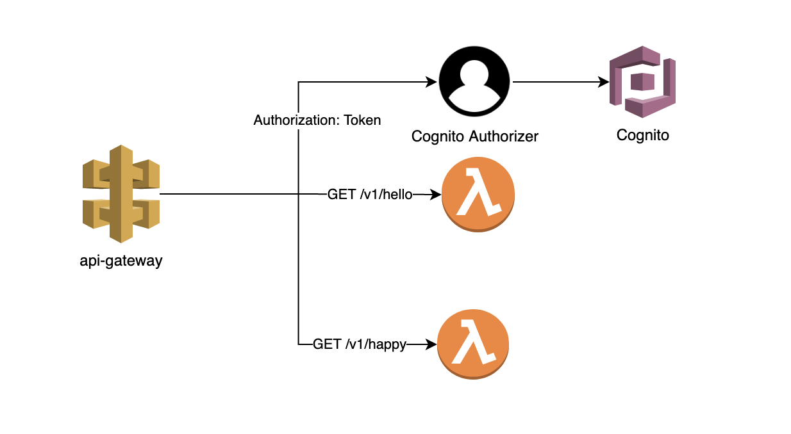

This repository contains the collection of CloudFormation templates and codes to deploy
- cognito
- services
- api-gateway

The samples included is not full proof solution but just meant to show the `proof of concept` for creating cognito based authorization for microservices based on lambdas. Following is the architecture diagram of the components being created by this sample.


Below is the directory structure of the CloudFormation tempaltes. The integers in the directory names signify the sequence of the stack creation for the sake of ease.

- `Readme.md` is for the documentation
- `01-cognito` folder contains necessary files to create cognito userpool
- `01-services` folder contains two lambda services(`happy-world/hello-world`) that when plugged behind api-gateway gives a basic response. **01** integer number means both cognito/services can be deployed in first step independent of each other.
- `02-api-gateway` creates api gateway with congito authorizes which requires us to `Authorization:` header to pass in the requests. It also creates two `GET` methods `/v1/happy` and `/v1/hello` and integrates two lambdas created by `01-services` stacks.

NOTE: The `02-api-gateway` makes uses of the nested stack to create decoupled cloudformation templating.
    - `parent stack` creates api gateway, authorizer, stage and other stacks that are common to api-gateway
    - `child stack 1` where resources specifics to `happy-world` API resources
    - `child stack 2` where resources specifics to `hello-world` API resources

```
├── Readme.md
└── components
    ├── 01-cognito
    ├── 01-services
    │   └── happy-world
    │   └── hello-world
    └── 02-api-gateway
        └── apis
            └── happy-world-v1.yaml
            └── world-world-v1.yaml
```

## Creating Stack
### Export necessary environment variables
- Export environment variables
```shell
export CFN_BUCKET=sam-bucket #bucket name to host the sam and nested templates
export AWS_PROFILE=sandbox #name of the aws profile to used while launching stacks
export AWS_REGION=us-east-1 # AWS Region
export NAMESPACE=balman #valid string to provide simple naming of the stacks
```
### 01. Cognito
- Create the stack
```shell
make -C components/01-cognito create-stack
```
OR

```shell
cd components/01-cognito
aws cloudformation create-stack --stack-name ${NAMESPACE}-cognito-userpool --template-body file://stack.yaml --parameters ParameterKey=Namespace,ParameterValue=${NAMESPACE} --profile ${AWS_PROFILE} --region ${AWS_REGION}
```

### 01. Services
Create all the backend services here. Right now in this scope I have created two basic lambda services called `happy-world` and `hello-world` that returns "Happy World!!" and "Hello World!!" when plugged behind APIGateway.

##### Deploy happy-world lambda
```shell
make -C components/01-services/happy-world deploy
```
OR

```shell
cd components/01-services/happy-world
sam package --template-file stack.yaml --output-template-file packaged.yaml --s3-bucket ${CFN_BUCKET}--profile ${AWS_PROFILE} --region ${AWS_REGION}
sam deploy --template-file packaged.yaml --stack-name ${NAMESPACE}-happy-world-lambda --capabilities CAPABILITY_IAM --parameter-overrides EnvironmentType=production Namespace=${NAMESPACE} --profile ${AWS_PROFILE} --region ${AWS_REGION}
```


##### Deploy hello-world lambda
```shell
make -C components/01-services/hello-world deploy
```
OR

```shell
cd components/01-services/hello-world
sam package --template-file stack.yaml --output-template-file packaged.yaml --s3-bucket ${CFN_BUCKET}--profile ${AWS_PROFILE} --region ${AWS_REGION}
sam deploy --template-file packaged.yaml --stack-name ${NAMESPACE}-hello-world-lambda --capabilities CAPABILITY_IAM --parameter-overrides EnvironmentType=production Namespace=${NAMESPACE} --profile ${AWS_PROFILE} --region ${AWS_REGION}
```

### 02. APIGateway
```shell
make -C components/02-api-gateway  deploy
```

OR

```shell
aws cloudformation package --template-file stack.yaml --s3-bucket ${CFN_BUCKET} --output-template-file packaged.yaml --profile ${AWS_PROFILE} --region ${AWS_REGION}
aws cloudformation deploy --stack-name ${NAMESPACE}-api-gateway-ecr --template-file packaged.yaml --parameter-overrides Namespace=${NAMESPACE} --capabilities CAPABILITY_IAM --profile ${AWS_PROFILE} --region ${AWS_REGION}
```

### 02. Verify
- Generate the `AcessToken` by using the Cognito URLs
- curl -H "Authorization: Bearer <token>" <endpoint> OR POSTMAN


### Full Demo Gif

